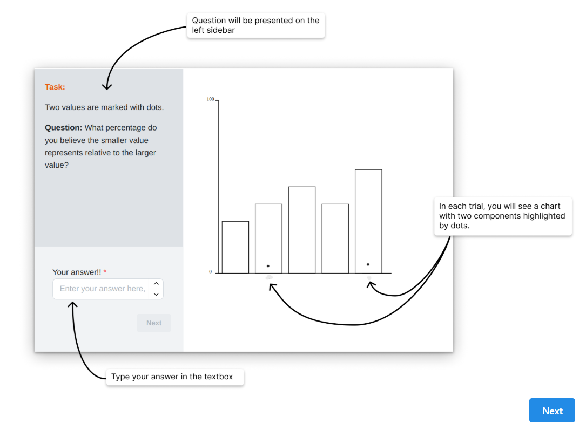
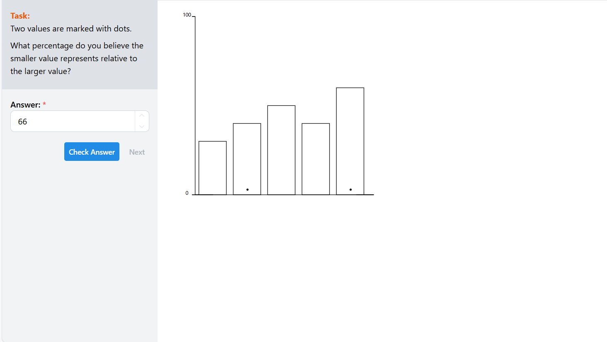
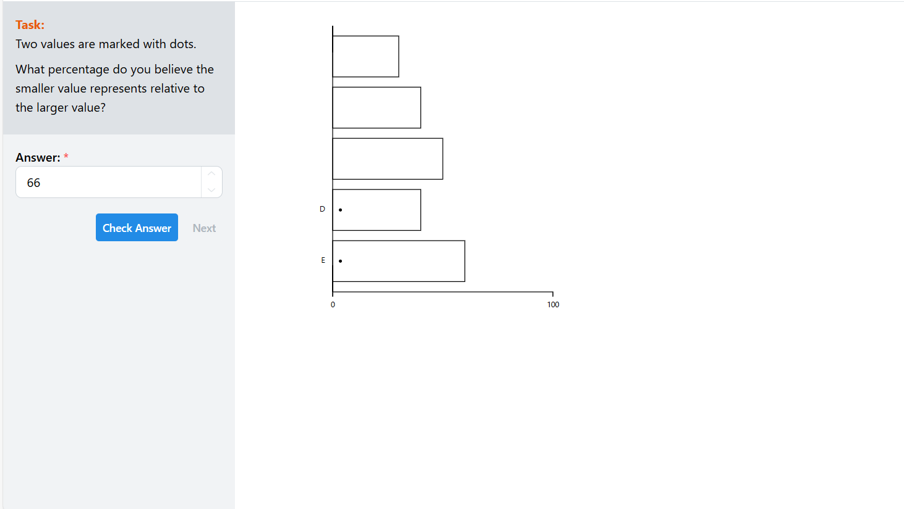
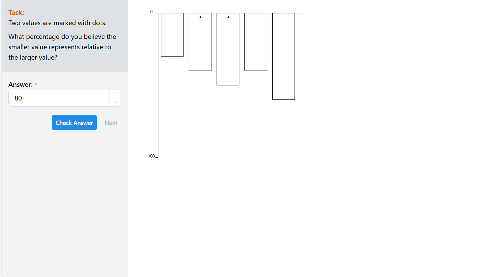
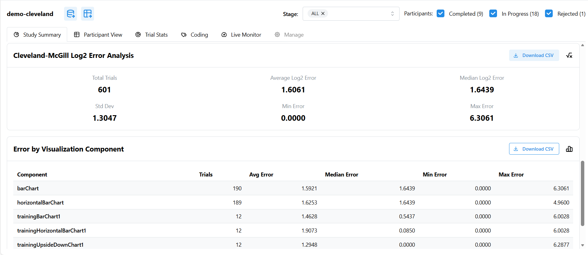

## Vertical vs. Horizontal vs. Upside-Down Bar Chart Study

Link: https://bpsupernova.github.io/a3-experiment/

## Done by Benjamin Perry, Ha Chu, Yanhong Liu, & Conor McCoy

---

## General Description of the Study

This study investigates whether there is an optimal orientation of bar charts for perceptual judgment tasks. We compare vertical, horizontal, and upside-down bar charts to determine which allows participants to most accurately estimate relative magnitudes.

Optimality is defined as **perceptual accuracy**, measured by how close a participant’s estimate is to the true percentage value. In each trial, participants estimate what percent the smaller bar represents relative to the larger bar.

Each participant completes:

* A training phase
* 20 randomized trials per visualization type
* Three visualization types total:

  * Vertical bars
  * Horizontal bars
  * Upside-down bars

Bar values and trial order are randomized after training. Training trials are fixed.

The study collects participant estimates, computes perceptual error, and compares visualization performance using a standardized perceptual error model.

---

## Experimental Task

Participants view two bars and estimate:

> What percent of the larger bar does the smaller bar represent?

Responses are recorded as whole-number percentages.

---

## Error Metric

### Raw Error

Per trial, error is the absolute difference between the true percentage and the participant’s reported percentage:

```
rawError = |reportedPercent − truePercent|
```

Whole-number percentages are used (e.g., 25, not 0.25).

---

### Scaled Error (Perceptual Error)

To model perceptual accuracy, raw error is transformed using a log-base-2 scaling:

```
log2Error = log2(rawError + 1/8)
```

Special rule:

* If a participant reports the exact correct value, error is set to **0**
* This avoids assigning negative error values for perfect performance

This transformation reflects perceptual sensitivity and compresses large errors while preserving relative differences.

---

## Data Collection Requirements

To ensure reliable results:

* At least 10 participants OR
* At least 200 trials per visualization type total

Each participant contributes:

* ≥ 20 trials per visualization type

Participant results are saved individually and combined into a master dataset containing all trials across all participants.

---

## Aggregating Results

To compare visualization performance:

1. Combine all trials from all participants
2. Group trials by visualization type
3. Compute mean log2Error per visualization

Lower mean log2Error indicates higher perceptual accuracy.

Visualizations are ranked from lowest to highest mean error.

---

## Bootstrapped 95% Confidence Intervals

To quantify uncertainty in the mean error estimates, we compute bootstrapped 95% confidence intervals.

Bootstrapping procedure:

1. Randomly resample trials with replacement
2. Compute mean error of sample
3. Repeat many times (thousands of resamples)
4. Use the 2.5th and 97.5th percentiles as confidence bounds

These intervals are shown as error bars in result figures.

Bootstrapping provides a robust estimate of variability without assuming a specific distribution.

---

## Visualization Ranking Output

Final results include:

* Mean perceptual error per visualization
* Bootstrapped 95% confidence intervals
* Ordered ranking from best to worst performance

Lower error = better perceptual accuracy.

---

## Screenshots of Experimental Stimuli

Training interface:


Vertical bar estimation task:


Horizontal bar estimation task:


Upside-down bar estimation task:


Data analysis interface:


These images show the exact stimuli used during the experiment.

---

## Technical Achievements

* Randomized trial generation using algorithmic configuration
* Automatic error computation and downloadable CSV export
* Deployment and execution using ReVISit
* Implementation of horizontal and upside-down bar charts in React + D3
* Automatic aggregation and analysis pipeline

---

## Design Achievements

* Separate training and experimental phases
* Training failure does not prevent experiment completion
* Dot markers constrained to lower bar region regardless of orientation
* Multiple visualization orientations within a single unified study

---

## Data Processing Pipeline

1. Collect participant responses
2. Save per-participant CSV files
3. Combine into master dataset
4. Compute raw error per trial
5. Transform to log2-scaled perceptual error
6. Aggregate by visualization type
7. Compute mean error and bootstrapped confidence intervals
8. Rank visualization performance

---

## Interpretation Goals

The study evaluates how bar orientation influences perceptual judgment accuracy.

Results help determine:

* Whether orientation affects magnitude estimation
* Which bar presentation supports most accurate comparisons
* Whether orientation changes perceptual difficulty

---

## Reproducibility

All experimental stimuli, response data, and analysis procedures are reproducible from the deployed study and exported CSV files.

---

---

## Results

### Participants and Trial Counts

* Total trials (vertical bar chart): **212**
* Total trials (horizontal bar chart): **212**
* Total trials (upside-down bar chart): **211**
* Total experimental trials overall: **635**

Each visualization condition exceeds the requirement of at least 200 trials.

---

### Mean Perceptual Error by Visualization

Perceptual accuracy was measured using log₂-scaled error. Lower values indicate better performance (more accurate estimates).

| Rank | Visualization Type        | Mean log₂ Error |
| ---- | ------------------------- | --------------- |
| 1    | **Horizontal bar chart**  | **1.588**       |
| 2    | **Vertical bar chart**    | **1.622**       |
| 3    | **Upside-down bar chart** | **1.670**       |

Visualizations are ordered from most accurate (lowest perceptual error) to least accurate.

---

### Visualization Performance Comparison


*(Error bars represent bootstrapped 95% confidence intervals if included in analysis.)*

---

### Key Findings

* The most accurate visualization was the **horizontal bar chart**, producing the lowest mean perceptual error.
* The least accurate visualization was the **upside-down bar chart**.
* Differences between visualization types were relatively small but consistent across a large number of trials.

---

### Interpretation

These results suggest that bar chart orientation has a measurable but modest effect on perceptual accuracy when estimating relative magnitudes.

Our hypothesis that sideways (horizontal) bar charts would be most optimal was **supported**.

One possible explanation is that horizontal bars align more naturally with left-to-right visual scanning and provide a stable baseline for comparison, while upside-down bars may disrupt baseline interpretation and spatial expectations.

---
